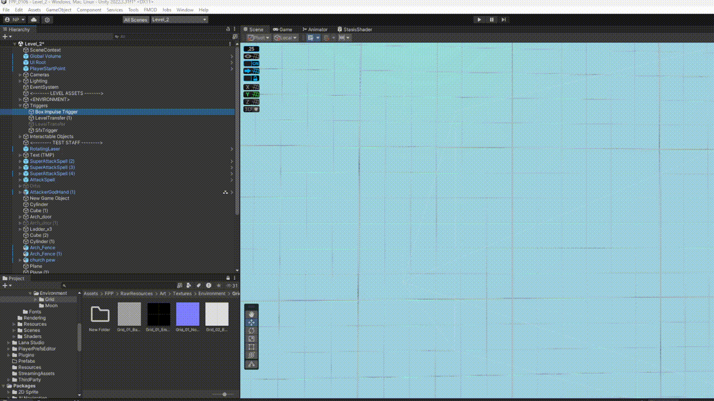
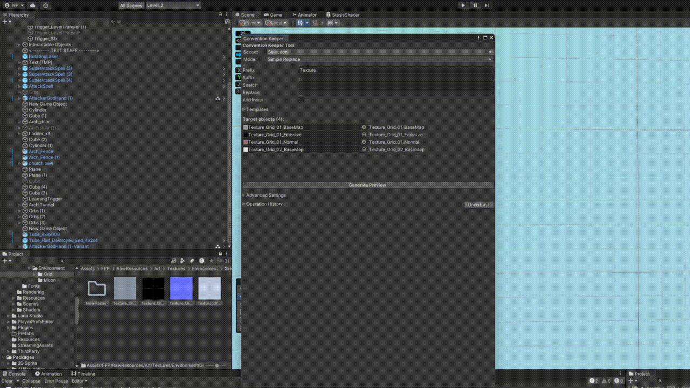

# Convention Keeper

This is a Unity Editor Tool for batch renaming GameObjects and assets with advanced features like regex support, templates, and operation history.

## Overview

Convention Keeper streamlines the process of maintaining consistent naming conventions across your Unity projects. Whether you're organizing scene objects or cleaning up asset names, this tool provides flexible renaming capabilities with a safety net of undo operations.

## Key Features

### Basic Renaming Operations
- **Prefix/Suffix Addition**: Quickly add consistent prefixes or suffixes to multiple objects
- **Search & Replace**: Replace specific text patterns across selected objects
- **Index Numbering**: Automatically append sequential numbers to objects
- **Real-time Preview**: See exactly what your objects will be renamed to before applying changes



*Demonstration of basic search and replace functionality*

### Advanced Asset Management
The Advanced Settings panel provides powerful filtering capabilities:
- **Type Filtering**: Target specific object types (GameObjects, Textures, Materials, etc.)
- **Scope Control**: Choose between selected objects or entire scene
- **Smart Detection**: Automatically handles both scene objects and project assets


*Using type filters to rename only texture assets while leaving other objects unchanged*

### Operation History & Safety
Never lose work with the built-in undo system:
- **Complete Operation History**: Track all renaming operations with timestamps
- **Selective Undo**: Revert specific operations without affecting others
- **Export History**: Save operation logs for project documentation



*Demonstrating the undo system to safely revert renaming operations*

## Installation

1. Copy the `ConventionKeeper` folder to your project's `Assets/Editor` directory
2. The tool will appear under `Tools > Convention Keeper` in the Unity menu

## Usage

### Basic Workflow
1. **Select** objects in the Hierarchy or Project window
2. **Open** Convention Keeper from `Tools > Convention Keeper`
3. **Configure** your renaming parameters (prefix, suffix, search/replace)
4. **Preview** the changes using "Generate Preview"
5. **Apply** changes with "Rename All"

### Advanced Features

#### Regex Support
Switch to "Regex Replace" mode for complex pattern matching:
```
Search: weapon_(\d+)_(.+)
Replace: $2_$1
```
This would transform `weapon_01_sword` into `sword_01`.

#### Templates
Save frequently used renaming patterns:
- Create templates for common naming conventions
- Load templates across different projects
- Share templates with team members

#### Type Filtering
Use Advanced Settings to target specific object types:
- `GameObject` - Only scene objects
- `Texture` - Only texture assets  
- `Material` - Only material files
- `AudioClip` - Only audio files

## Technical Details

### Compatibility
- Unity 2021.3 LTS and newer
- Works with both 2D and 3D projects
- Supports all standard Unity object types

### Performance
- Optimized for large selections (1000+ objects)
- Memory-efficient preview generation
- Non-blocking UI updates

### Safety Features
- Automatic duplicate name detection
- Invalid character sanitization
- Asset vs. scene object handling
- Complete operation reversibility
